# 🛍️ EcommerceShoporia


A modern **Flutter e-commerce app** with a complete authentication system, clean architecture, and responsive UI.  
Built with **GetX** for state management and powered by a **secure Laravel API backend**.  

---

## 🚀 Getting Started

### Prerequisites

- [Flutter SDK](https://flutter.dev/docs/get-started/install) (latest stable)
- An IDE like **Android Studio** or **VS Code** with Flutter plugin
- Backend API available here 👉 [flutter-ecommerce-api](https://github.com/AmeeNexTech/flutter-ecommerce-api)

### Installation

```sh
# Clone the repository
git clone https://github.com/AmeeNexTech/ecommerceshoporia.git

# Navigate to the project directory
cd ecommerceshoporia

# Install the dependencies
flutter pub get

# Run the app
flutter run

``` 

# 🛍️ Flutter E-commerce App

## ✅ Completed Features
- 🔐 **Authentication**: Login, signup, email verification with OTP, and password recovery  
- 🎨 **UI/UX**: Responsive design, smooth animations, Arabic (RTL) & English (LTR) support  
- 🔒 **Security**: Secure token storage (flutter_secure_storage), input validation, centralized error handling  

---

## 🔧 In Development
- Home Products & Categories   

---

## 🎯 Planned Features (Roadmap)
- Authentication (Login, Signup, OTP, Recovery)  
- Home Products & Categories  
- Shopping Cart  
- Wishlist & Favorites  
- Order Tracking & History  
- Product Reviews & Ratings  
- Payment Gateway Integration  
- Push Notifications (orders & promotions)  

---

## 🧰 Tech Stack

| Category         | Technologies & Concepts |
|------------------|--------------------------|
| **Architecture** | Clean Architecture, Feature-first Structure, Repository Pattern, SOLID |
| **State Mgmt.**  | GetX (Reactive State, Dependency Injection, Route Management) |
| **Networking**   | Dio (HTTP requests), Centralized Error Handling |
| **Local Storage**| flutter_secure_storage (for secure token storage) |
| **UI/UX**        | Material Design 3, Responsive & Adaptive UI, RTL (Arabic) Support |
| **Localization** | GetX Localization (AR/EN multi-language) |
| **Backend**      | Laravel API |

---

## 📊 Project Status
- **Foundation**: 100% ✅ (Authentication, UI, Security)  
- **E-commerce Core**: 0% 🔧 (Products, Cart, Payment)  
- **Overall Progress**: ~40%  

---

## 📱 App Screenshots

<details> <summary>Click to expand</summary>

🚀 **Splash Screen**  
<div align="center">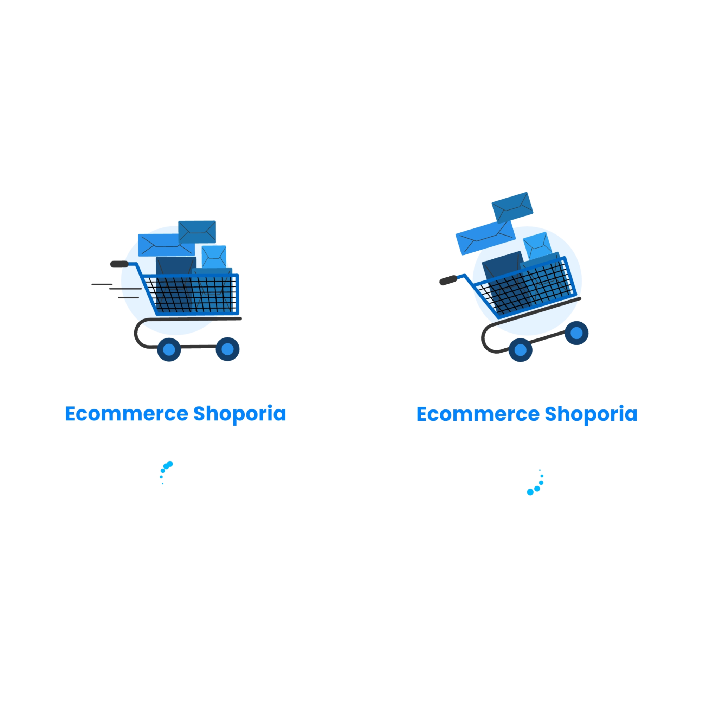</div>  

🌍 **Language Selection**  
<div align="center">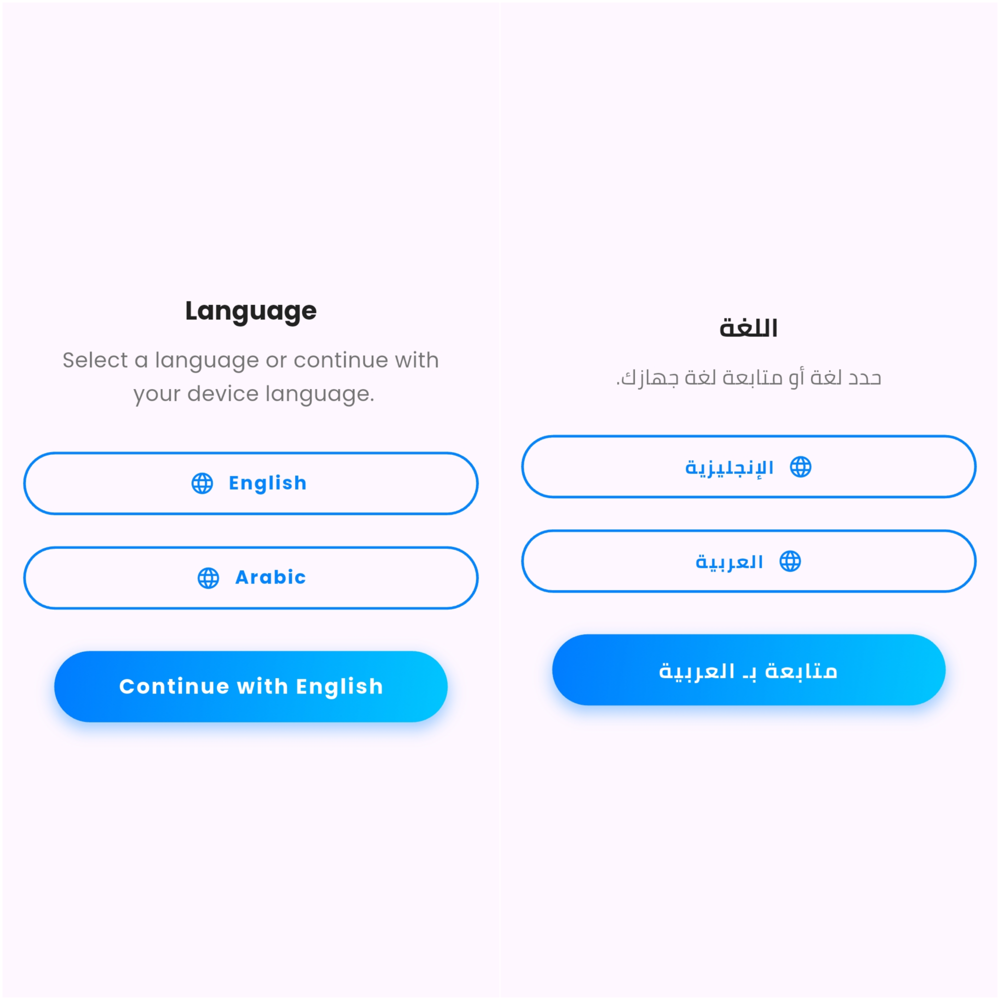</div>  

📖 **Onboarding**  
<div align="center">  
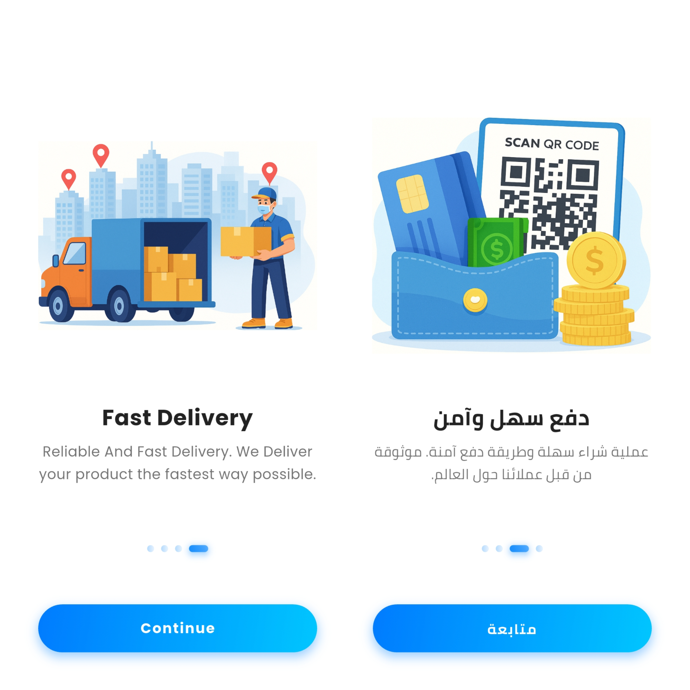  
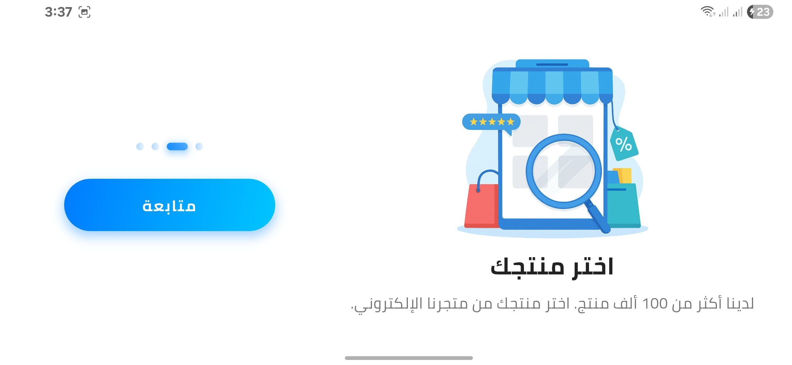  
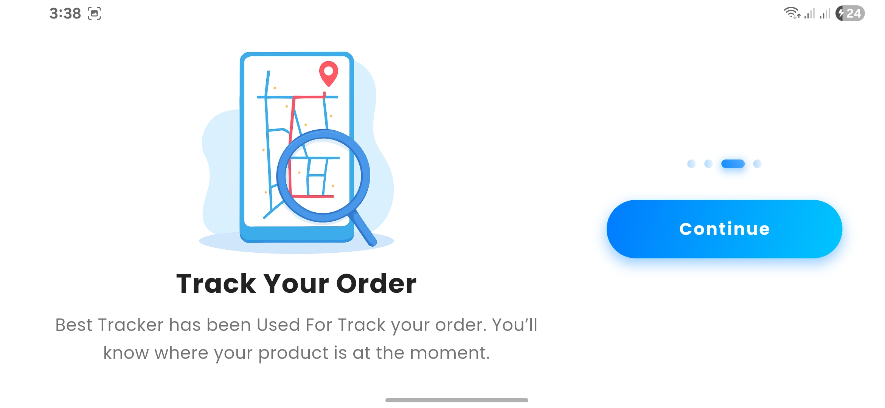  
</div>  

🔐 **Authentication**  
<div align="center">  
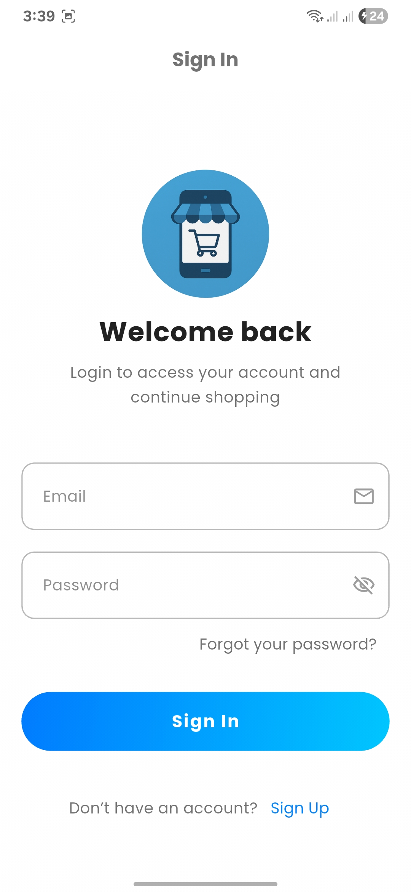  
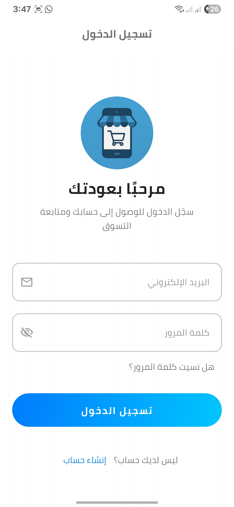  
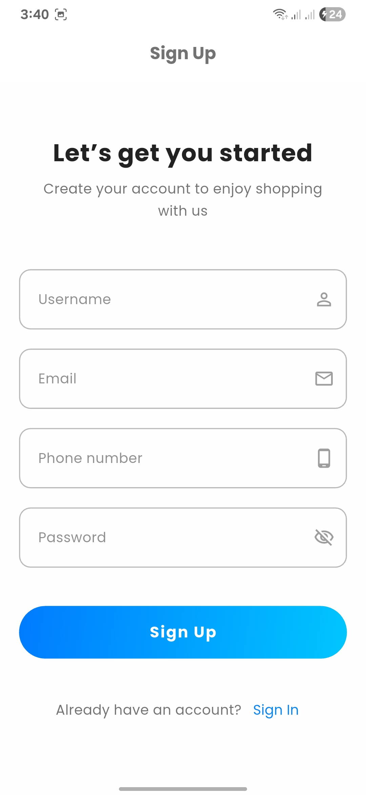  
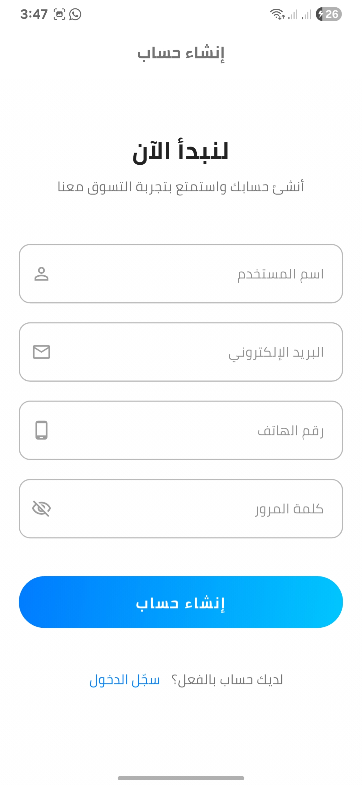  
</div>  

🔑 **Password Recovery & OTP**  
<div align="center">  
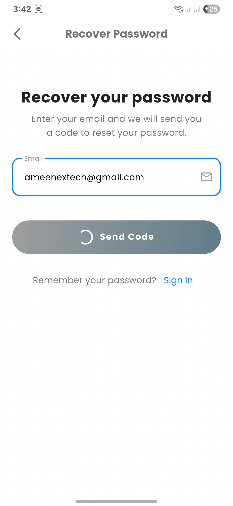  
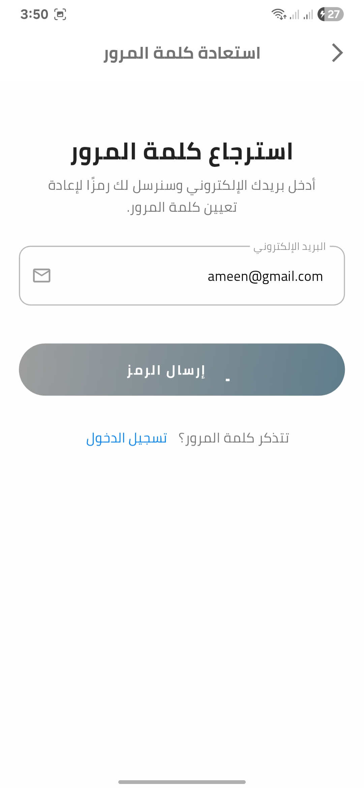  
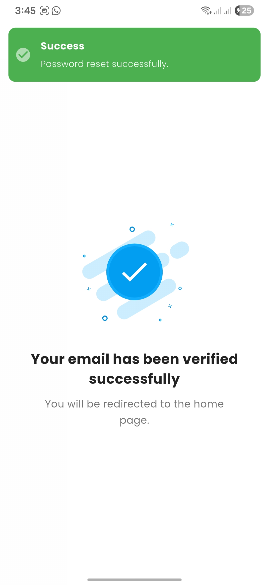  
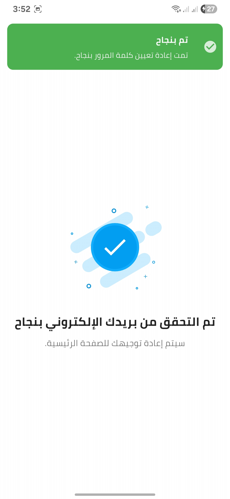  
</div>  

✅ **Success & Account Management**  
<div align="center">  
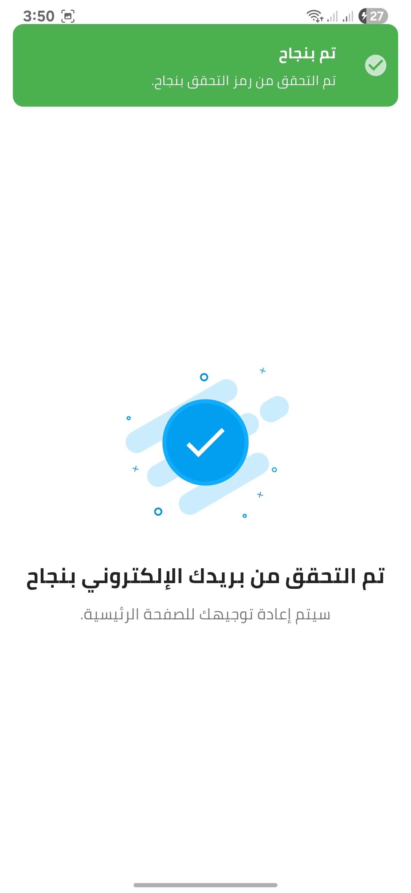  
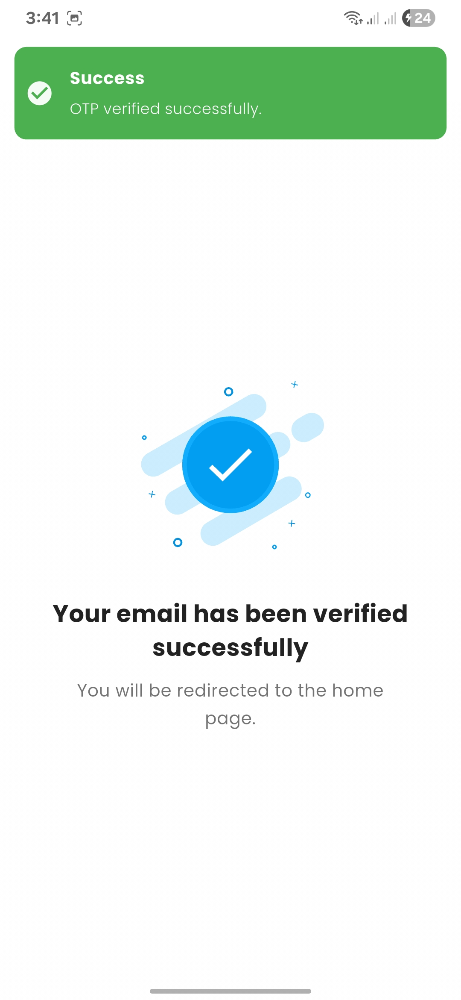  
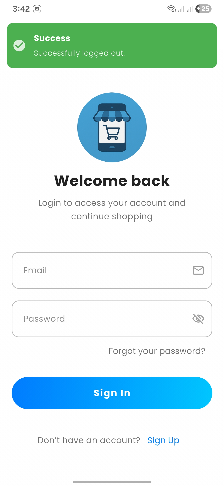  
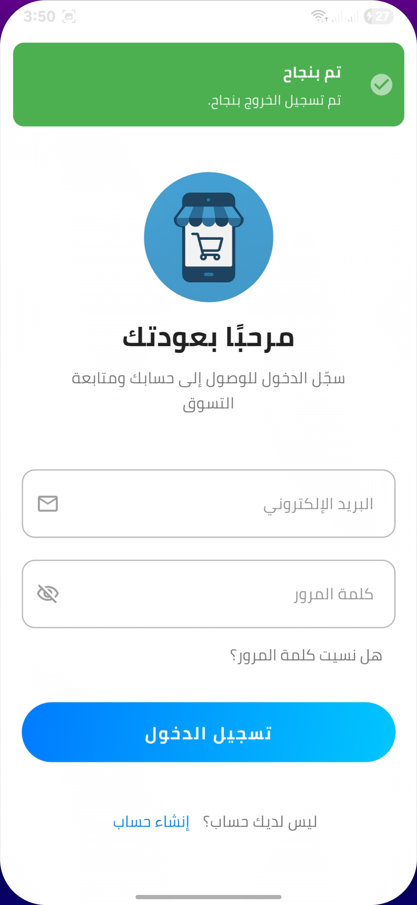  
  
</div>  

⚠️ **Error Handling**  
<div align="center">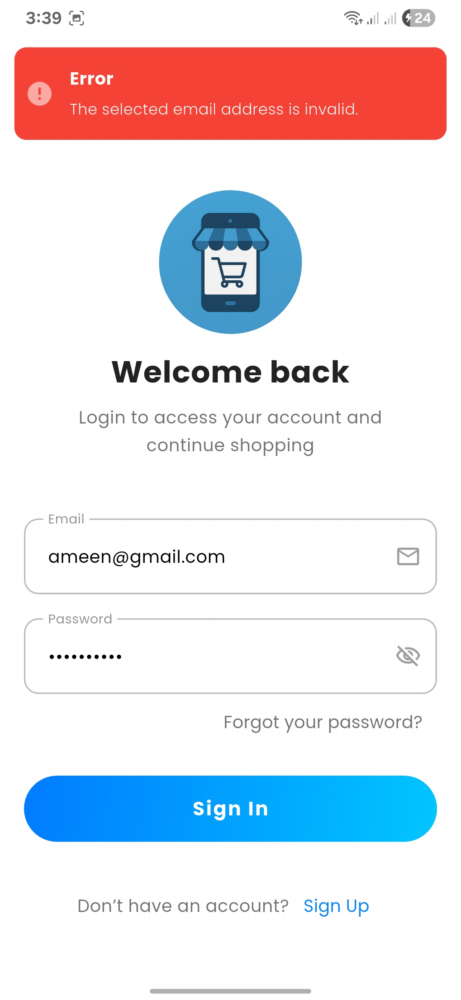</div>  

</details>

---
## 📁 **Project Structure**

The project follows a feature-first approach based on Clean Architecture principles.

```
lib/
├── main.dart
├── core/
│   ├── constant/
│   ├── di/
│   ├── error/
│   ├── localization/
│   ├── services/
│   └── utils/
├── features/
│   ├── auth/
│   │   ├── data/
│   │   │   ├── datasources/
│   │   │   └── repositories/
│   │   ├── domain/
│   │   │   ├── entities/
│   │   │   ├── repositories/
│   │   │   └── usecases/
│   │   └── presentation/
│   │       ├── controllers/
│   │       ├── screens/
│   │       └── widgets/
│   ├── home/
│   └── initial_flow/
└── routes/
```

| Directory      | Description                                                                                                                                |
|----------------|--------------------------------------------------------------------------------------------------------------------------------------------|
| `main.dart`    | The entry point of the application.                                                                                                        |
| `core/`        | Contains shared code used across multiple features, such as constants, services, utilities, and error handling.                             |
| `features/`    | Contains the different features of the application (e.g., `auth`, `home`). Each feature is a self-contained module with its own layers.      |
| `  - data/`      | The data layer, responsible for fetching data from remote or local sources and implementing the repository contracts from the domain layer.    |
| `  - domain/`    | The domain layer, containing the business logic, entities, use cases, and repository contracts. It is independent of other layers.         |
| `  - presentation/` | The presentation layer, containing the UI (screens and widgets) and state management logic (controllers).                                  |
| `routes/`      | Manages navigation and app routes using GetX.                                                                                              |

## 🤝 **Contributing**

Contributions are what make the open-source community such an amazing place to learn, inspire, and create. Any contributions you make are **greatly appreciated**.

If you have a suggestion that would make this better, please fork the repo and create a pull request. You can also simply open an issue with the tag "enhancement".

1.  Fork the Project
2.  Create your Feature Branch (`git checkout -b feature/AmazingFeature`)
3.  Commit your Changes (`git commit -m 'Add some AmazingFeature'`)
4.  Push to the Branch (`git push origin feature/AmazingFeature`)
5.  Open a Pull Request

---

**Built with ❤️ using Flutter**