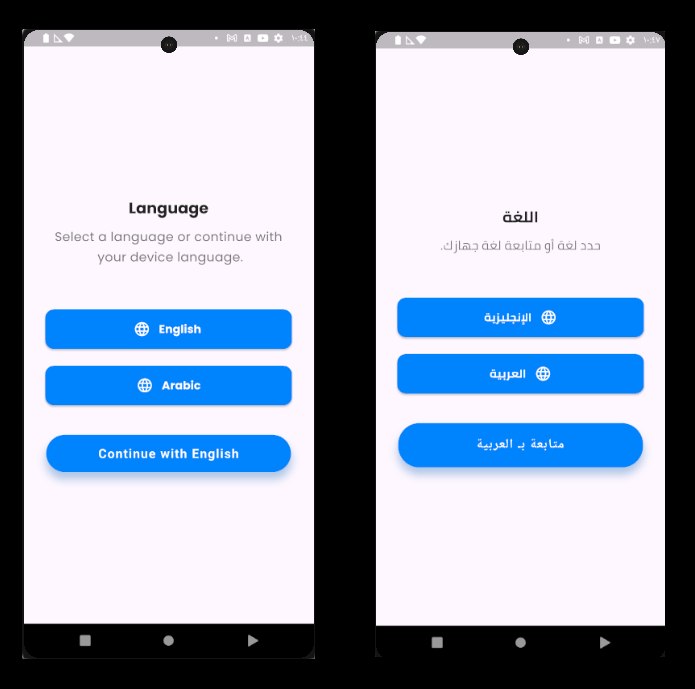
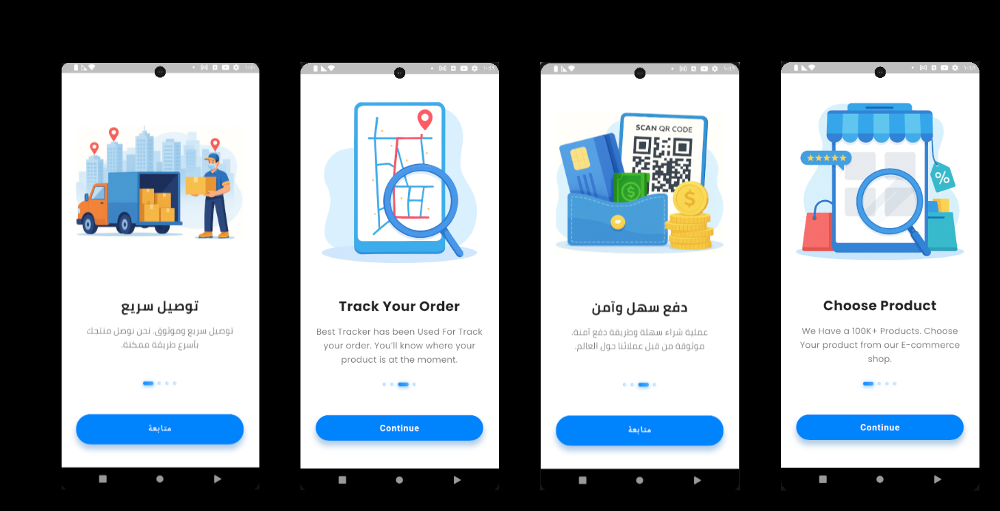

# 🛍️ EcommerceShoporia

**EcommerceShoporia** is a modern e-commerce application developed using **Flutter**.  
The app aims to provide a complete online shopping experience, including order tracking, cart management, and electronic payment options.

---

## Current Progress

- ✅ **Completed the language selection screen**  
  

- ✅ **Completed the onboarding screens (Supports Arabic and English)**  
  

- 🔧 **Currently working on login and password recovery screens**

---

## 🎯 Planned Features

- 🛒 Browse product categories and items  
- ❤️ Manage favorite products  
- 🛍️ Shopping cart functionality  
- 📍 Order tracking via Google Maps  
- ⭐ Product ratings and customer reviews  
- 🎟️ Coupon system for discounts  
- 🔔 Push notifications for order updates and promotions  
- 💳 Electronic payment options  
- 🖥️ Web-based admin panel for full control over the application  

---

## 🧰 Tech Stack & Tools

| Technology / Tool                              | Purpose / Usage                                                                 |
|------------------------------------------------|----------------------------------------------------------------------------------|
| **Flutter**                                    | Cross-platform mobile app development                                           |
| **Dart**                                       | Main programming language for Flutter                                           |
| **GetX**                                       | State management, routing, dependency injection                                 |
| **Firebase**                                   | Push notifications (authentication handled via backend)                         |
| **MySQL**                                      | Relational database to store application data                                   |
| **PHP (Laravel)**                              | Backend API to connect the Flutter app with the database                        |
| **Laravel Sanctum**                            | Token-based authentication and API protection                                   |
| **Form Requests (Laravel)**                    | Secure and centralized API request validation                                   |
| **CORS & CSRF Config**                         | Secure API communication and protection                                         |
| **flutter_secure_storage**                     | Securely store tokens and login credentials locally                             |
| **shared_preferences**                         | Store user preferences and app settings locally                                 |
| **Dio + Interceptors**                         | Advanced API client with error handling, loading indicators, and logging        |
| **Freezed + JsonSerializable**                 | Clean, immutable models with automatic JSON serialization                       |
| **flutter_screenutil / responsive_framework**  | Responsive UI support across different screen sizes                             |
| **flutter_native_splash + launcher_icons**     | Improve first impression and app branding                                       |
| **Shimmer / Skeleton Loading**                 | Loading placeholders while data is fetched                                      |
| **Scroll to Top + Lazy Loading**               | Efficient navigation and on-demand data loading                                 |
| **Empty & Error States**                       | Better user feedback for empty lists and API errors                             |
| **flutter_lints**                              | Code quality enforcement and style consistency                                  |
| **integration_test**                           | Full app testing for login, purchase flows, and more                            |
| **Rate Limiting (Laravel)**                    | Prevent brute-force attacks and abuse of API endpoints                          |

---

## 📄 Project Documentation

The documentation is written from my personal learning journey, aiming to explain each part of the app in a clear and simple way.  
I’ve tried to break down the logic, structure, and purpose behind every main feature to help myself — and hopefully others — better understand how things work.

🧭 [Onboarding Flow](https://github.com/AmeeNexTech/flutter-ecommerce/blob/main/docs/onboarding.md) — Full breakdown of the onboarding logic using GetX, MVC, and PageView  
🌐 [Localization System](https://github.com/AmeeNexTech/flutter-ecommerce/blob/main/docs/localization.md) — How language selection, translations, and persistent language settings are implemented

---

## 🚧 Project Status

The project is under **active development**, with regular updates made as progress continues.

---

## 💡 Notes

This is a **personal project** built by a passionate beginner developer focused on creating high-quality mobile apps.  
The goal of this project is to **learn, grow, and document** the journey of building a full-featured e-commerce app from scratch.  
By sharing this project, I aim to reflect on my progress and provide value to others who may be learning as well.

---

## 🙋‍♂️ How to Contribute

This is a learning project, but feel free to open issues, suggest improvements, or fork it to build your own version!

