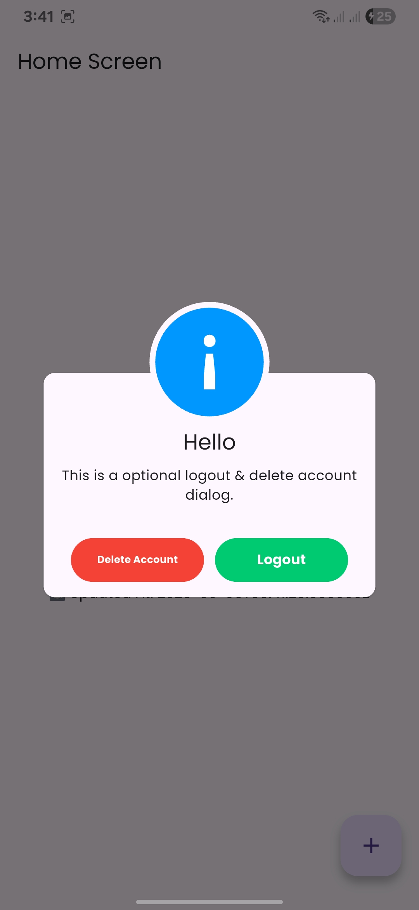

# 🛍️ EcommerceShoporia

A modern Flutter e-commerce app with complete authentication system and responsive UI.

## ✅ **Completed Features**

- 🔐 **Authentication**: Login, signup, email verification, password recovery
- 🎨 **UI/UX**: Responsive design, animations, Arabic/English support
- 🔒 **Security**: Secure token storage, input validation, 

## 🔧 **In Development**
- 🛒 Product catalog and shopping cart


## 🎯 **Planned Features**
- 🛍️ Shopping cart and checkout
- ❤️ Wishlist and favorites
- 📍 Order tracking
- ⭐ Reviews and ratings
- 💳 Payment integration
- 🔔 Push notifications

---

## 🧰 **Tech Stack**

| Category | Technologies |
|----------|-------------|
| **Frontend** | Flutter 3.7.2+, GetX, Dio, Lottie |
| **Backend** | Laravel, MySQL, Laravel Sanctum |
| **Architecture** | Clean Architecture, Repository Pattern |
| **Security** | Secure Storage, Token Auth, Input Validation |
| **UI/UX** | Material Design 3, Responsive Design, RTL Support |

## 📊 **Project Status**
- **Foundation**: 100% ✅ (Auth, UI, Security)
- **E-commerce**: 0% 🔧 (Products, Cart, Payment)
- **Overall Progress**: 40%

---

## 📱 **App Screenshots**

### 🚀 **Splash Screen**
<div align="center">
  
</div>

### 🌍 **Language Selection**
<div align="center">
  
</div>

### 📖 **Onboarding Screens**
<div align="center">
  
  
  
</div>

### 🔐 **Authentication Screens**

#### Login (English & Arabic)
<div align="center">
  
  
</div>

#### Signup (English & Arabic)
<div align="center">
  
  
</div>

#### Password Recovery (English & Arabic)
<div align="center">
  
  
</div>

#### Email Verification (English & Arabic)
<div align="center">
  
  
</div>

### ✅ **Success Screens**
<div align="center">
  
  
</div>

### 🚪 **Logout & Account Management**
<div align="center">
  
  
  
</div>

### ⚠️ **Error Handling**
<div align="center">
  
</div>

## 🚀 **Getting Started**

```bash
# Clone and run
git clone https://github.com/yourusername/ecommerceshoporia.git
cd ecommerceshoporia
flutter pub get
flutter packages pub run build_runner build
flutter run
```

## 📁 **Project Structure**
```
lib/
├── core/          # Constants, services, utils
├── data/          # Models, repositories, datasources  
├── controller/    # Business logic
├── view/          # Screens and widgets
└── bindings/      # Dependency injection
```

## 🤝 **Contributing**
- 🐛 Report bugs
- 💡 Suggest features  
- 🔧 Submit pull requests
- ⭐ Star the project

---
**Built with ❤️ using Flutter**

